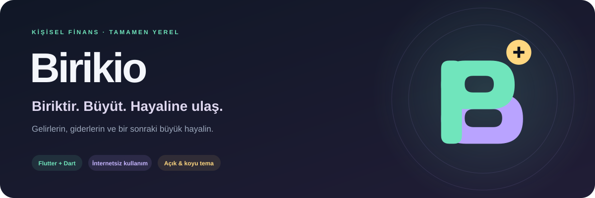
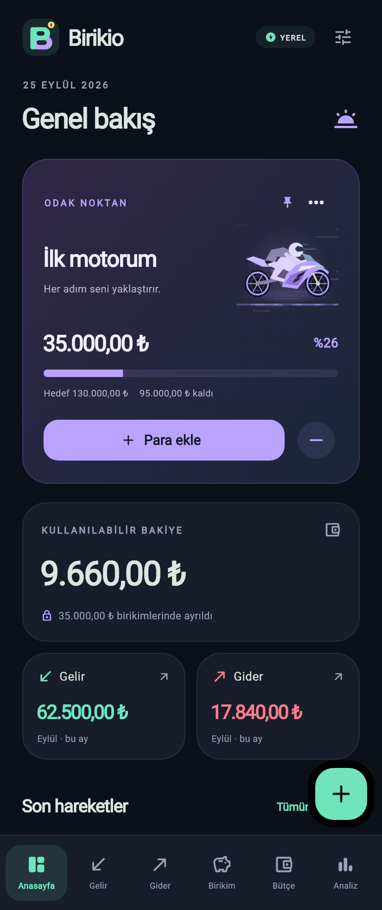
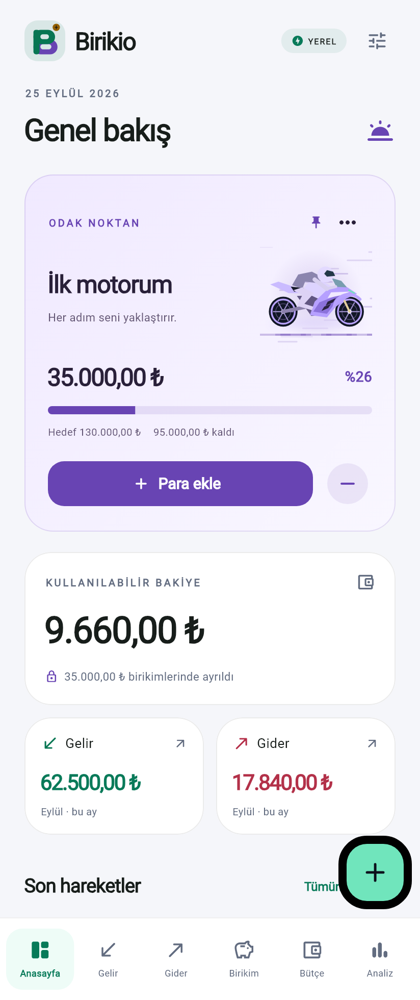
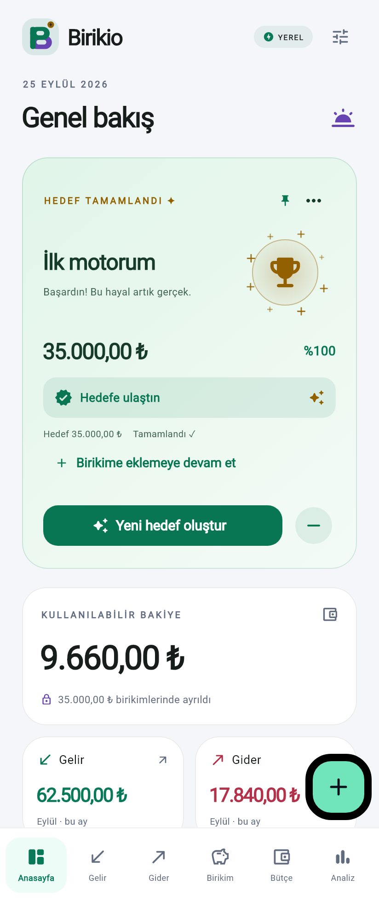
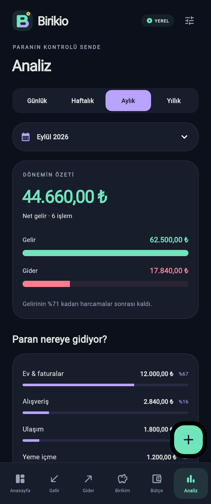

<p align="center">
  
</p>

<p align="center">
  <strong>Gelirini tanı. Harcamalarını gör. Hayaline yer aç.</strong><br />
  Türkçe, animasyonlu ve internet bağlantısı gerektirmeyen kişisel finans uygulaması.
</p>

<p align="center">
  <a href="#ekran-görüntüleri">Ekran görüntüleri</a> ·
  <a href="#özellikler">Özellikler</a> ·
  <a href="#kurulum">Kurulum</a> ·
  <a href="#veriler-ve-hesaplama">Veriler ve hesaplama</a> ·
  <a href="#geliştirme">Geliştirme</a>
</p>

---

Birikio, günlük para takibini birikim hedeflerinle bir araya getirir. İster ilk motorun, ister bir tatil, ister bir güvence birikimi: hedefini seç, para ayır ve ilerlemeni gör. Hesap oluşturman gerekmez; kayıtların cihazında tutulur.

## Ekran görüntüleri

<table>
  <tr>
    <td align="center"><strong>Koyu tema</strong><br /><sub>Hedefin, bakiyen ve aylık özetin.</sub><br /><br /></td>
    <td align="center"><strong>Açık tema</strong><br /><sub>Aynı deneyim, aydınlık bir görünüm.</sub><br /><br /></td>
  </tr>
  <tr>
    <td align="center"><strong>Hedef tamamlandı</strong><br /><sub>Her başarı yeni bir başlangıç.</sub><br /><br /></td>
    <td align="center"><strong>Dönem analizi</strong><br /><sub>Paranın nereye gittiğini keşfet.</sub><br /><br /></td>
  </tr>
</table>

<sub>Görseller gerçek Flutter arayüzünden, yalnızca tanıtım için oluşturulmuş örnek verilerle alınmıştır.</sub>

## Özellikler

| Ekran | Neler yapabilirsin? |
| --- | --- |
| **Anasayfa** | Sabitlenmiş hedefini, kullanılabilir bakiyeni, aylık gelir–gider toplamlarını ve son 5 kaydı gör. |
| **Gelir** | Tutar, kaynak, kategori, tarih ve not ekle; kayıtlarını ara, düzenle veya sil. |
| **Gider** | Harcamalarını kategorilere ayır, not al ve tekrarlayan giderlerini takip et. |
| **Birikim** | Birden fazla hedef oluştur, simge seç, para ekle veya çek; aktarım geçmişini incele. |
| **Bütçe** | Her ay için harcama limiti belirle; kullanılan, kalan ve aşılan tutarı gör. |
| **Analiz** | Günlük, haftalık, aylık veya yıllık özetleri incele; dönem seçmeden önce toplamları gör. |

### Daha az uğraş, daha düzenli takip

- **Tekrarlayan kayıtlar:** günlük, haftalık, aylık veya yıllık gelir ve giderler; başlangıç tarihi ve tekrarı durdurma seçeneği.
- **Esnek formlar:** gelir kaynağı, gider adı, hedef adı ve not isteğe bağlıdır. İsimsiz kayıtlara uygun bir ad atanır.
- **Geri tuşu:** açık pencereyi kapatır, diğer sekmelerden ana sayfaya döner; ana sayfada uygulamadan çıkmaz.
- **Hızlı ekleme:** her ekrandaki **+** düğmesinden gelir, gider veya birikim hedefi oluştur.
- **Başarı görünümü:** hedef tamamlandığında kart yeşile döner; altın kupa, parıltılar ve yeni hedef düğmesi belirir.
- **Tema ve hareket tercihi:** varsayılan olarak sistem temasını anlık takip etme; isteğe bağlı açık/koyu tema seçimi, animasyonları kapatma ve onaylı veri silme.

### Hareketli bir deneyim

Birikio açılırken logonun katmanları birleşir, altın para yerine oturur ve uygulama adı belirir. Sayfa geçişlerinde kayma, yakınlaşma, bulanıklık ve ışık efektleri birlikte kullanılır.

Yarış motorunun dönen jantları ve kayan yol çizgileri, diğer hedeflerin kendilerine özgü hareketleri, para ekleme/çekmedeki yeşil–kırmızı banknotlar ve animasyonlu ilerleme göstergeleri hedeflerini görünür kılar. Azaltılmış hareket tercihinde açılış animasyonu atlanır.

## Kurulum

**Gereksinimler:** Dart `^3.12.2` ile uyumlu Flutter SDK; Android için Android SDK ve bir emülatör veya USB hata ayıklaması açık cihaz. iOS derlemesi için macOS ve Xcode gerekir.

Proje klasöründe:

```sh
flutter pub get
flutter devices
flutter run
```

Birden fazla cihaz varsa:

```sh
flutter run -d <cihaz-kimliği>
```

Android deneme paketi oluşturmak için:

```sh
flutter build apk --debug
```

APK, `build/app/outputs/flutter-apk/app-debug.apk` konumunda oluşur. Bu paket geliştirme/test içindir; mağaza yayını için dağıtım imzası ve platform ayarları ayrıca hazırlanmalıdır.

> Android emülatöründe derleme ve görünüm kontrolü yapılmıştır. iOS projesi mevcuttur; iOS cihaz derlemesi henüz doğrulanmamıştır.

## Veriler ve hesaplama

### Cihazında kalır

Uygulama sunucu, kullanıcı hesabı veya internet bağlantısı gerektirmez. Kayıtlar `SharedPreferencesAsync` üzerinden yerel JSON olarak tutulur; Android tarafında DataStore kullanılır. Uygulama içinde analitik veya ağ çağrısı bulunmaz ve Android otomatik yedekleme kapalıdır.

Tutarlar **tam sayı kuruş** olarak saklanır. Kaydetme başarısız olursa bellekteki değişiklik geri alınır. Açılışta veriler okunamazsa mevcut kayıtları koruyan bir tekrar deneme ekranı gösterilir.

### Bakiye nasıl hesaplanır?

```text
Kullanılabilir bakiye = Toplam gelir − Toplam gider − Ayrılmış net birikim
```

Örneğin 10.000 ₺ gelir, 2.000 ₺ gider ve hedefe ayrılmış 3.000 ₺ varsa kullanılabilir bakiye **5.000 ₺** olur.

- Birikime aktarma bir gider, birikimden çekme bir gelir sayılmaz.
- Hedef silinirse o hedefe ayrılan tutar kullanılabilir bakiyeye döner.
- Aylık bütçe limiti, bakiyeyi değiştirmeyen bir harcama planıdır.
- Birikim hedef tutarının altına düşerse başarı kartı tekrar ilerleme görünümüne döner.

### Otomatik kayıtlar ne zaman eklenir?

Tekrarlar açılışta, uygulama ön plana geldiğinde ve açıkken dakikada bir kontrol edilir. Uygulama kapalıyken arka plan servisi çalışmaz; kaçırılan dönemler bir sonraki açılışta kendi tarihleriyle tamamlanır.

Aynı dönem iki kez eklenmez; silinmiş otomatik kayıt yeniden oluşturulmaz. Aylık tekrar başlangıç gününe bağlı kalır: **31 Ocak → 28/29 Şubat → 31 Mart**.

Bir kaydı düzenlemek yalnızca seçili kaydı değiştirir. Gelecek tekrarın tutarını veya sıklığını değiştirmek için mevcut tekrarı durdurup yeni bir tekrar oluşturabilirsin.

> **Mevcut sınırlar:** dışa aktarma ve cihazlar arası taşıma henüz yoktur. Uygulamayı kaldırmak veya uygulama verilerini temizlemek yerel kayıtları silebilir.

## Geliştirme

**Altyapı:** Flutter · Dart · Material 3 · `ChangeNotifier` · `SharedPreferencesAsync` · Flutter yerelleştirme araçları.

```text
lib/
├── main.dart             # Uygulama başlangıcı
├── data/
│   └── store.dart        # Modeller, hesaplar, tekrarlar ve yerel saklama
└── ui/
    ├── app.dart          # Tema, navigasyon ve ana ekranlar
    ├── forms.dart        # Kayıt, hedef ve aktarım formları
    ├── reports.dart      # Bütçe ve dönem analizleri
    ├── palette.dart      # Temaya uygun finans renkleri
    ├── widgets.dart      # Ortak bileşenler ve görsel animasyonlar
    ├── brand.dart        # Birikio logosu
    └── launch.dart       # Animasyonlu açılış ve veri yükleme
```

### Kontroller

```sh
flutter analyze
flutter test
```

Testler; para ayrıştırma, ay sonu ve artık yıl davranışları, tekrarların tekilleştirilmesi, aktarım bakiyesi, kalıcılık, yazma hatasında geri alma, tema kontrastı, hedef tamamlama ve açılış akışlarını kapsar.

### Görselleri yeniden üretme

README ekran görüntüleri uygulamanın gerçek bileşenlerinden, bellekte tutulan örnek verilerle üretilir:

```sh
flutter test tools/capture_readme.dart --dart-define=FLUTTER_SDK=/flutter/sdk/yolu
```

Logo ve platform simgelerini üretmek için Python ve Pillow gerekir:

```sh
python -m pip install pillow
python tools/generate_icon.py
python tools/readme_banner.py
```

[Düzenlenebilir SVG logo](docs/images/birikio-logo.svg) · [Uygulama simgesi](artifacts/birikio-icon-round.png)

---

<p align="center"><strong>Birikio</strong><br /><sub>Küçük adımlar. Büyük birikimler.</sub></p>

