<p align="center">
  
</p>

<p align="center">
  <strong>Gelirini tanı. Harcamalarını gör. Hayaline yer aç.</strong><br />
  Türkçe, animasyonlu ve internet bağlantısı gerektirmeyen kişisel finans uygulaması.
</p>

<p align="center">
  <a href="#ekran-görüntüleri">Ekran görüntüleri</a> ·
  <a href="#özellikler">Özellikler</a> ·
  <a href="#kurulum">Kurulum</a> ·
  <a href="#veriler-ve-hesaplama">Veriler ve hesaplama</a> ·
  <a href="#geliştirme">Geliştirme</a>
</p>

---

Birikio, günlük para takibini birikim hedeflerinle bir araya getirir. İster ilk motorun, ister bir tatil, ister bir güvence birikimi: hedefini seç, para ayır ve ilerlemeni gör. Hesap oluşturman gerekmez; kayıtların cihazında tutulur.

## Ekran görüntüleri

Görseller uygulamanın güncel Flutter arayüzünden, cihazda saklanmayan kurgu örnek verilerle üretildi. Tutarlar ve tarihler yalnızca anlatım içindir.

### 1. Bir bakışta durumun

Anasayfada kullanılabilir bakiyeyi, bu ayın gelir ve giderini ve birikim hedefinin ilerlemesini birlikte görürsün. Açık ve koyu tema aynı verileri gösterir.

<table>
  <tr>
    <td align="center"><strong>Koyu tema</strong><br /><sub>Bakiye, aylık özet ve hedef ilerlemesi.</sub><br /><br />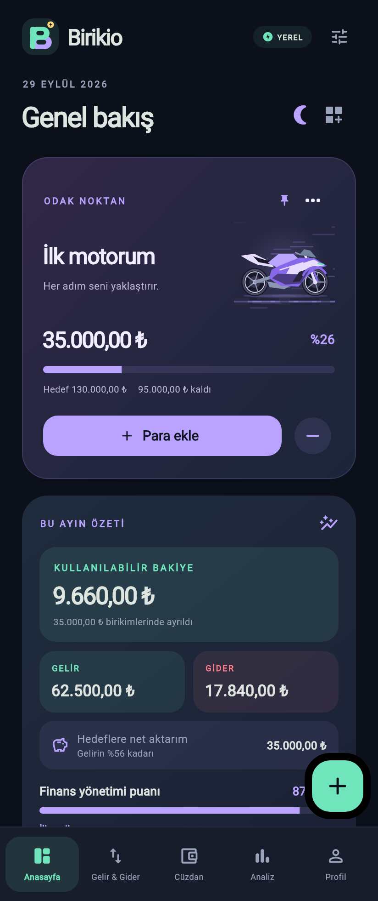</td>
    <td align="center"><strong>Açık tema</strong><br /><sub>Aynı finansal görünüm açık renkte.</sub><br /><br />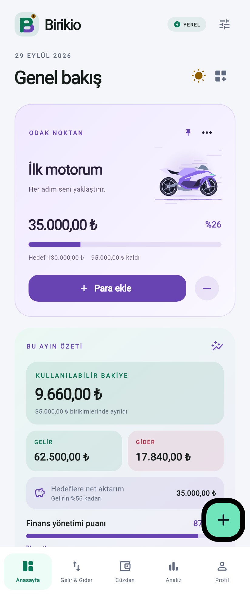</td>
  </tr>
</table>

### 2. Gelir ve giderlerini kaydet

Alttaki **+** düğmesi gelir, gider ve birikim hedefi ekleme akışlarını açar. Gelir & Gider ekranında kayıtları birlikte veya türüne göre görebilir; kategori, tarih, tutar ve tekrar durumuyla filtreleyebilirsin.

<table>
  <tr>
    <td align="center"><strong>Hızlı ekleme</strong><br /><sub>Her ekrandan yeni kayıt oluştur.</sub><br /><br />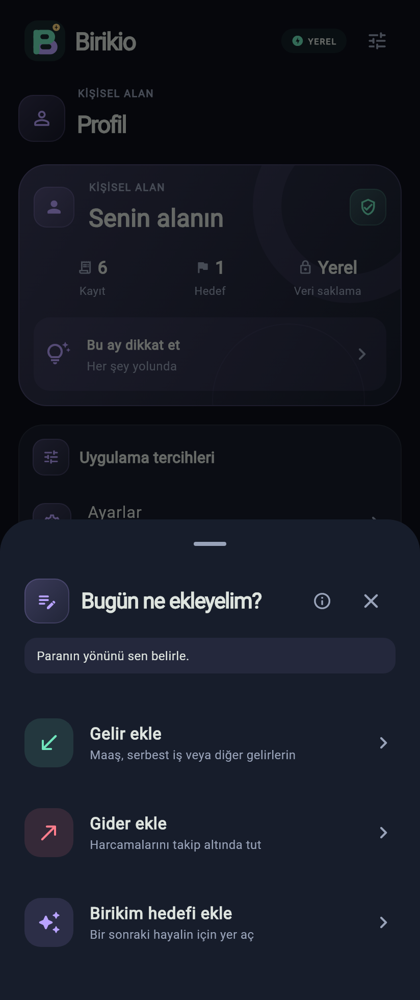</td>
    <td align="center"><strong>Gelir & Gider</strong><br /><sub>Gerçekleşmiş işlemler ve düzenli ödemeler.</sub><br /><br />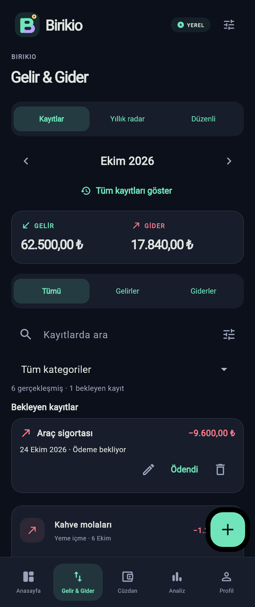</td>
  </tr>
</table>

### 3. İleri tarihli gideri veya düzenli ödemeyi planla

Gider formunda ileri tarih seçersen tek seferlik kayıt **bekleyen ödeme** olur ve radara eklenir. **Düzenli ödeme** seçeneğiyle sıklığı ve isteğe bağlı bitiş tarihini belirleyebilirsin. Otomatik seçilen düzenli ödemeler vadesinde gider kaydı oluşturur; bu, bankadan tahsilat doğrulaması değildir.

<table>
  <tr>
    <td align="center"><strong>Gider ekle</strong><br /><sub>Tutar, kategori ve ödeme tarihini seç.</sub><br /><br />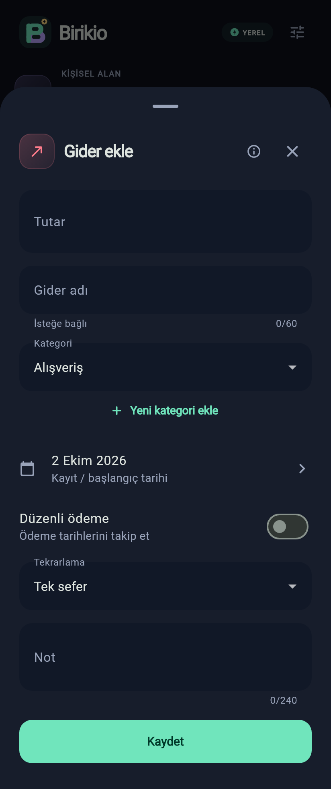</td>
    <td align="center"><strong>Düzenli ödeme</strong><br /><sub>Sıklık, otomatik kayıt ve bitiş tarihi.</sub><br /><br />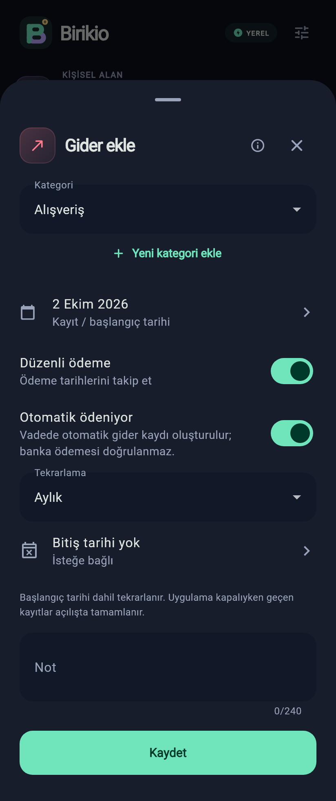</td>
  </tr>
</table>

### 4. Yaklaşan masrafları radarda izle

**Gelir & Gider → Giderler → Yıllık radar** yolundan takvimi açabilirsin. Tek seferlik ileri tarihli giderler, yıl içindeki düzenli ödeme vadeleri ve ayrıca eklediğin yıllık masraf planları aynı yerde görünür. Ay kutularında toplam planlanan tutarı, ödeme kartlarında **Bekliyor / Gecikti / Ödendi** durumunu görürsün.

<table>
  <tr>
    <td align="center"><strong>Giderler</strong><br /><sub>Radar, giderlerin içinden açılır.</sub><br /><br />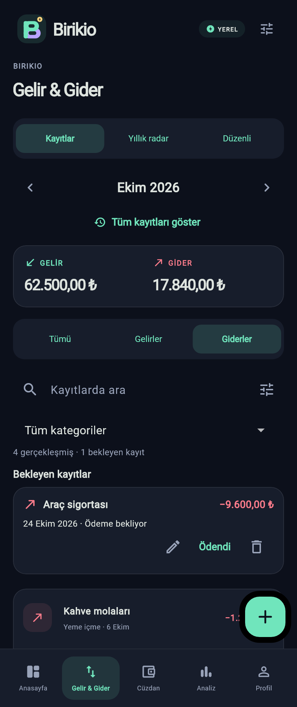</td>
    <td align="center"><strong>Yıllık radar</strong><br /><sub>Aylara dağılan bekleyen masraflar.</sub><br /><br />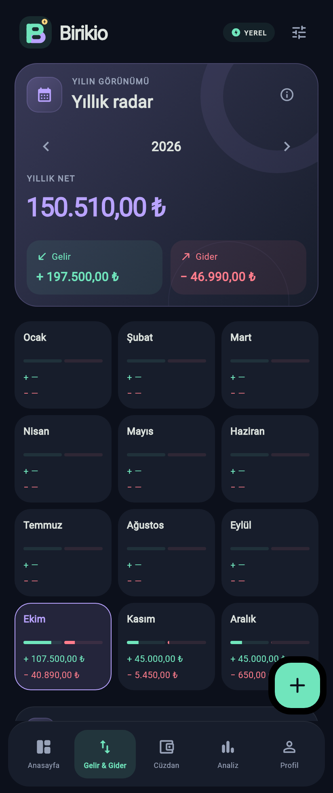</td>
  </tr>
  <tr>
    <td align="center"><strong>Ödeme vadeleri</strong><br /><sub>Tek seferlik ve düzenli giderler aynı listede.</sub><br /><br />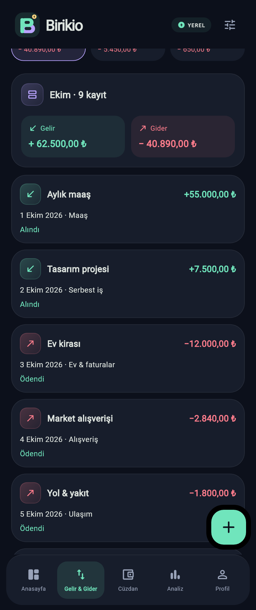</td>
    <td align="center"><strong>Ödeme davranışı</strong><br /><sub>Bekleyen ödeme bakiyeyi etkilemez. Ödendi olarak kaydederken gerçek tutarı girebilirsin; o anda giderlere ve bakiyeye yansır.</sub></td>
  </tr>
</table>

### 5. Hedeflerini ve genel gidişatı gör

Cüzdan birikim hedeflerini ve bütçeleri; Analiz dönemlik gelir gider dengesini gösterir. Hedef tamamlandığında kartın görünümü değişir. Profil, kategori ve veri yönetimine erişim sağlar.

<table>
  <tr>
    <td align="center"><strong>Cüzdan</strong><br /><sub>Hedefe ayrılan para ve ilerleme.</sub><br /><br />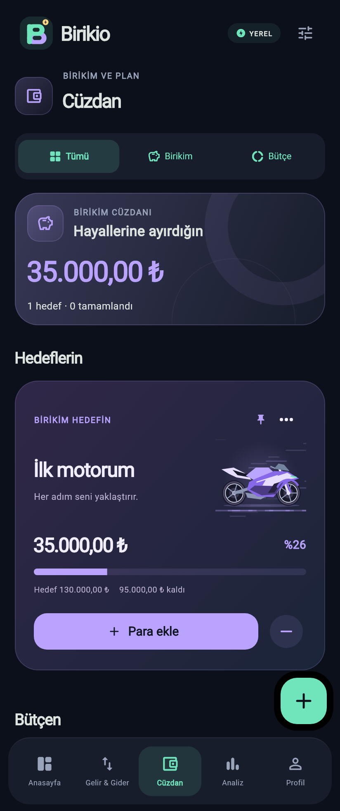</td>
    <td align="center"><strong>Hedef tamamlandı</strong><br /><sub>Tamamlanan hedefin başarı görünümü.</sub><br /><br />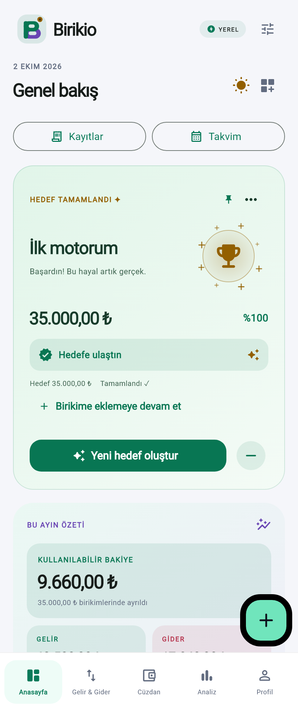</td>
  </tr>
  <tr>
    <td align="center"><strong>Analiz</strong><br /><sub>Dönemin gelir, gider ve net sonucu.</sub><br /><br />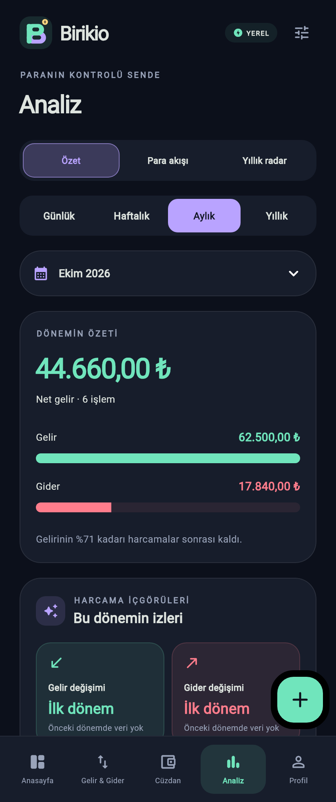</td>
    <td align="center"><strong>Profil</strong><br /><sub>Uyarılar, kategoriler ve ayarlar.</sub><br /><br />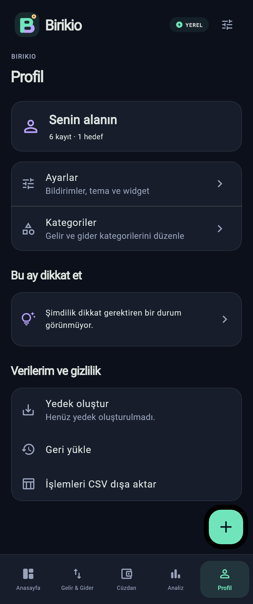</td>
  </tr>
</table>

## Özellikler

| Ekran | Neler yapabilirsin? |
| --- | --- |
| **Anasayfa** | Hedefini, kullanılabilir bakiyeni, aylık özeti, finans yönetimi puanını ve geciken ödemeleri gör; kartları açıp kapat ve sıralarını düzenle. |
| **Gelir & Gider** | İşlemleri filtrele; ileri tarihli giderleri, düzenli ödemeleri ve Yıllık Radar'ı aynı akışta yönet. |
| **Cüzdan** | Birikim hedeflerini tarih ve aylık katkıyla planla; genel ve kategori bütçelerini izle. |
| **Analiz** | Günlük, haftalık, aylık veya yıllık dönemi seç; gelir/gider karşılaştırmasını, harcama içgörülerini, kategori dağılımını, Paranın Yolculuğu akışını ve Yıllık Masraf Radarı'nı gör. |
| **Profil** | Kategorileri ve yerel bildirimleri yönet; JSON yedek oluştur/geri yükle ve Türkçe CSV aktar. |

### Daha az uğraş, daha düzenli takip

- **Tekrarlayan kayıtlar:** günlük, haftalık, aylık veya yıllık gelir ve giderler; başlangıç tarihi, isteğe bağlı bitiş tarihi, durdurma ve geçmiş kayıtları koruyarak seriyi silme seçenekleri.
- **Faturalar:** otomatik seçilenler vadede gider olarak yazılır; manuel seçilenler yalnızca ödendi işaretlenince bakiyeyi etkiler. Gerçek banka tahsilatı doğrulanmaz.
- **Bildirimler:** izin verilirse bütçe kullanım eşikleri, yaklaşan manuel düzenli ödemeler ve ileri tarihli tek seferlik giderler için cihaz içi hatırlatmalar planlanır. Teslim zamanı işletim sistemi ve pil kısıtlarına bağlıdır.
- **Android widget:** 1×1 hedef yüzdesi, 2×1 bakiye, 2×2 hedef, 2×3 bütçe ve 3×3 finansal özet seçenekleri vardır. Ayarlardaki görsel seçim penceresinde boyut ve içerik önizlenir. Bakiye gizlilik tercihiyle kapatılabilir; uygulama verisi değiştiğinde yenilenir.
- **Esnek formlar:** gelir kaynağı, gider adı, hedef adı ve not isteğe bağlıdır. İsimsiz kayıtlara uygun bir ad atanır.
- **Geri tuşu:** açık pencereyi kapatır, diğer sekmelerden ana sayfaya döner; ana sayfada uygulamadan çıkmaz.
- **Hızlı ekleme:** her ekrandaki **+** düğmesinden gelir, gider veya birikim hedefi oluştur.
- **Düzenlenebilir ana ekran:** başlıktaki düzenleme simgesinden hedef, aylık özet, ayrı bakiye, ayrı gelir/gider, son hareketler ve geciken ödeme kartlarını seçip sırala. Düzen cihazda saklanır. Varsayılan görünümde bakiye, gelir ve gider aylık özet kartında birlikte yer alır.
- **Finans yönetimi puanı:** son üç tamamlanmış ay ve içinde bulunulan ayın kayıtlarını; gelir/gider dengesi, bütçe limitleri, birikime yatırma ve çekme, düzenli faturalar, gelir düzeni, aylık gidişat, bakiye tamponu ve harcama dağılımı üzerinden değerlendirir. Detay ekranı her alanın puanını ve kayda dayalı yorumları gösterir. Verisi olmayan alanlar ağırlık hesabından çıkarılır; otomatik ödeme kayıtları banka tahsilatının kanıtı değildir.
- **Paranın Yolculuğu:** seçili dönemin gelirlerini, gider kategorilerini, birikime yatırma/çekmeyi ve dönemlik artışı ayrı akışlar halinde gösterir. Bir akışa dokununca onu oluşturan kayıtlar açılır. Çember grafiğinde paylar eşit kalınlıktaki dilimlerle gösterilir; dilime veya açıklamasına dokununca yüzdesi ve tutarı seçilir. Birikim aktarımı gelir veya gider sayılmaz.
- **Yıllık masraf radarı:** Gelir & Gider ekranından da açılır. İleri tarihli tek seferlik giderleri ve yıl içindeki düzenli gider vadelerini gösterir; sigorta, bakım veya okul gibi yıllık masrafları ayrıca planlayabilirsin. Bekleyen ödemeler bakiyeyi değiştirmez; ödendi olarak kaydedilenler giderlere eklenir. Ödenen tutar planlanandan farklı girilebilir.
- **Aylık birikim sözü:** her hedefe isteğe bağlı aylık tutar ve ayın son gününü ekleyebilirsin. Vade geçince eksik tutar hedef kartında ve Profil uyarısında görünür; zamanında ve gecikmeli yatırımlar finans puanında ayrı değerlendirilir. Eski hedefler kendiliğinden gecikmiş sayılmaz.
- **Profil ve yedek:** Profil, en önemli güncel uyarıyı ve son yedek tarihini gösterir. JSON yedeği güncel veri şemasını, aylık planları, ekran tercihlerini ve kurulu uygulamanın sürümünü taşır.
- **Android'de dosya kaydetme:** JSON yedeği ve CSV, sistemin belge oluşturma ekranında seçtiğin konuma yazılır. İptal edilen işlem son yedek tarihini değiştirmez.
- **Başarı görünümü:** hedef tamamlandığında kart yeşile döner; altın kupa, parıltılar ve yeni hedef düğmesi belirir.
- **Tema ve hareket tercihi:** varsayılan olarak sistem temasını anlık takip etme; isteğe bağlı açık/koyu tema seçimi, animasyonları kapatma ve onaylı veri silme.
- **Sürüm bilgisi:** uygulama başlığı, açılış ekranı ve ayarlarda kurulu paketin sürümü gösterilir.

### Hareketli bir deneyim

Birikio açılırken logonun katmanları birleşir, altın para yerine oturur ve uygulama adı belirir. Alt sekmeler arasındaki geniş dalga, seçilen sekmenin yönüne doğru kayar. Gelir & Gider, Cüzdan ve Analiz içindeki görünümler bulanıklıkla açılır; hareket azaltma tercihi bu geçişlere de uygulanır.

Yarış motorunun dönen jantları ve kayan yol çizgileri, diğer hedeflerin kendilerine özgü hareketleri, para ekleme/çekmedeki yeşil–kırmızı banknotlar, gelir/gider eklemedeki yönlü ışık parçacıkları ve animasyonlu ilerleme göstergeleri hedeflerini görünür kılar. Azaltılmış hareket tercihinde açılış ve kayıt animasyonları atlanır.

## Kurulum

**Gereksinimler:** Dart `^3.12.2` ile uyumlu Flutter SDK; Android için Android SDK ve bir emülatör veya USB hata ayıklaması açık cihaz. iOS derlemesi için macOS ve Xcode gerekir.

Proje klasöründe:

```sh
flutter pub get
flutter devices
flutter run
```

Birden fazla cihaz varsa:

```sh
flutter run -d <cihaz-kimliği>
```

Android deneme paketi oluşturmak için:

```sh
flutter build apk --debug
```

APK, `build/app/outputs/flutter-apk/app-debug.apk` konumunda oluşur. Bu paket geliştirme/test içindir; mağaza yayını için dağıtım imzası ve platform ayarları ayrıca hazırlanmalıdır.

> Android debug APK derlenmiştir. README görselleri Flutter widget testinde gerçek arayüz bileşenlerinden üretilir. iOS cihaz derlemesi henüz doğrulanmamıştır.

## Veriler ve hesaplama

### Cihazında kalır

Uygulama sunucu, kullanıcı hesabı veya internet bağlantısı gerektirmez. Kayıtlar `SharedPreferencesAsync` üzerinden sürümlü yerel JSON olarak tutulur; Android tarafında DataStore kullanılır. Eski sürümsüz kayıtlar açılırken korunur. Uygulama içinde analitik veya ağ çağrısı bulunmaz ve Android otomatik yedekleme kapalıdır.

Profil > Ayarlar > Verilerim bölümünde JSON yedeği cihazına kaydedebilir, geri yükleyebilir veya gelir/gider kayıtlarını CSV olarak aktarabilirsin. Geri yükleme mevcut yerel veriyi yedekteki veriyle değiştirir; önce onay istenir.

Tutarlar **tam sayı kuruş** olarak saklanır. Kaydetme başarısız olursa bellekteki değişiklik geri alınır. Açılışta veriler okunamazsa mevcut kayıtları koruyan bir tekrar deneme ekranı gösterilir.

### Bakiye nasıl hesaplanır?

```text
Kullanılabilir bakiye = Toplam gelir − Toplam gider − Ayrılmış net birikim
```

Örneğin 10.000 ₺ gelir, 2.000 ₺ gider ve hedefe ayrılmış 3.000 ₺ varsa kullanılabilir bakiye **5.000 ₺** olur.

- Birikime aktarma bir gider, birikimden çekme bir gelir sayılmaz.
- Hedef silinirse o hedefe ayrılan tutar kullanılabilir bakiyeye döner.
- Aylık bütçe limiti, bakiyeyi değiştirmeyen bir harcama planıdır.
- Birikim hedef tutarının altına düşerse başarı kartı tekrar ilerleme görünümüne döner.
- İleri tarihli tek seferlik giderler vadesine kadar bekleyen ödeme olarak tutulur; ödendi işaretlenince bakiyeye yansır.

### Otomatik kayıtlar ne zaman eklenir?

Tekrarlar açılışta, uygulama ön plana geldiğinde ve açıkken dakikada bir kontrol edilir. Uygulama kapalıyken arka plan servisi çalışmaz; kaçırılan dönemler bir sonraki açılışta kendi tarihleriyle tamamlanır.

Aynı dönem iki kez eklenmez; silinmiş otomatik kayıt yeniden oluşturulmaz. Aylık tekrar başlangıç gününe bağlı kalır: **31 Ocak → 28/29 Şubat → 31 Mart**.

Tekrardan oluşan bir kaydı düzenlerken yalnızca o kayıt, o ve sonraki kayıtlar veya tüm seri kapsamını seçebilirsin. Düzenli ödeme kartında gelecek tutarı ve vade gününü değiştirebilir; tekrarın bitiş tarihini ayarlayabilirsin. Sıklığı değiştirmek için mevcut seriyi durdurup yeni bir seri oluşturabilirsin.

> **Mevcut sınırlar:** cihazlar arası otomatik eşitleme yoktur. JSON yedeğiyle elle taşıma mümkündür. Uygulamayı kaldırmak veya uygulama verilerini temizlemek yerel kayıtları silebilir.

## Geliştirme

**Altyapı:** Flutter · Dart · Material 3 · `ChangeNotifier` · `SharedPreferencesAsync` · Flutter yerelleştirme araçları · `package_info_plus`.

```text
lib/
├── main.dart             # Uygulama başlangıcı
├── data/
│   ├── store.dart        # Modeller, hesaplar, tekrarlar ve yerel saklama
│   ├── analytics.dart    # Dönem karşılaştırmaları
│   ├── money_journey.dart # Dönemlik para akışı hesabı
│   ├── annual_radar.dart # Yıllık gider takvimi ve plan hesabı
│   ├── financial_health.dart # Finans yönetimi puanı ve yorumlar
│   ├── goal_plan.dart   # Aylık hedef vadeleri ve eksik tutar
│   ├── backup.dart       # JSON yedek ve CSV aktarımı
│   └── finance_document.dart # Veri şeması ve eski kayıt geçişi
├── services/             # Bildirimler ve Android ana ekran widget'ları
└── ui/
    ├── app.dart          # Tema, navigasyon ve ana ekranlar
    ├── forms.dart        # Kayıt, hedef ve aktarım formları
    ├── reports.dart      # Bütçe, dönem analizi ve içgörüler
    ├── money_journey.dart # Para akışı görünümü
    ├── annual_radar.dart # Yıllık masraf radarı görünümü
    ├── orbit_chart.dart  # Etkileşimli halka grafik
    ├── palette.dart      # Temaya uygun finans renkleri
    ├── widgets.dart      # Ortak bileşenler ve görsel animasyonlar
    ├── brand.dart        # Birikio logosu
    ├── launch.dart       # Animasyonlu açılış ve veri yükleme
    ├── app_version.dart  # Kurulu uygulama sürümü
    └── widget_picker.dart # Widget seçim penceresi
```

### Kontroller

```sh
flutter analyze
flutter test
```

Testler; para ayrıştırma, ay sonu ve artık yıl davranışları, tekrarların tekilleştirilmesi, aktarım bakiyesi, kalıcılık, veri geçişi, bütçe ve fatura hesapları, para akışı, yıllık masraf planları, dar ekran yerleşimi, tema kontrastı, widget seçimi, hedef tamamlama ve açılış akışlarını kapsar.

### Görselleri yeniden üretme

README'deki 13 ekran görüntüsü uygulamanın gerçek bileşenlerinden, bellekte tutulan kurgu örnek verilerle üretilir. Kendi Flutter SDK yolunu ver:

```sh
flutter test tools/capture_readme.dart --dart-define=FLUTTER_SDK=C:/flutter
```

Logo ve platform simgelerini üretmek için Python ve Pillow gerekir:

```sh
python -m pip install pillow
python tools/generate_icon.py
python tools/readme_banner.py
```

[Düzenlenebilir SVG logo](docs/images/birikio-logo.svg) · [Uygulama simgesi](artifacts/birikio-icon-round.png)

---

<p align="center"><strong>Birikio</strong><br /><sub>Küçük adımlar. Büyük birikimler.</sub></p>

